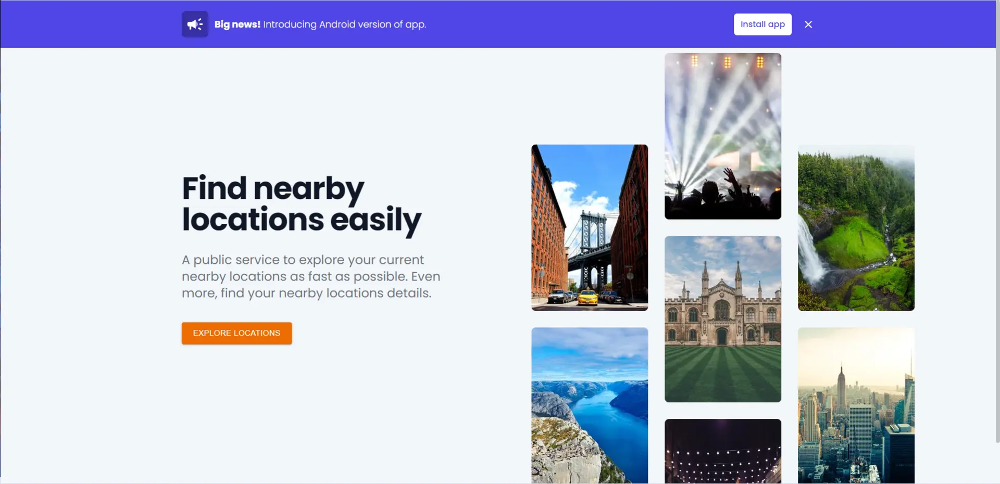
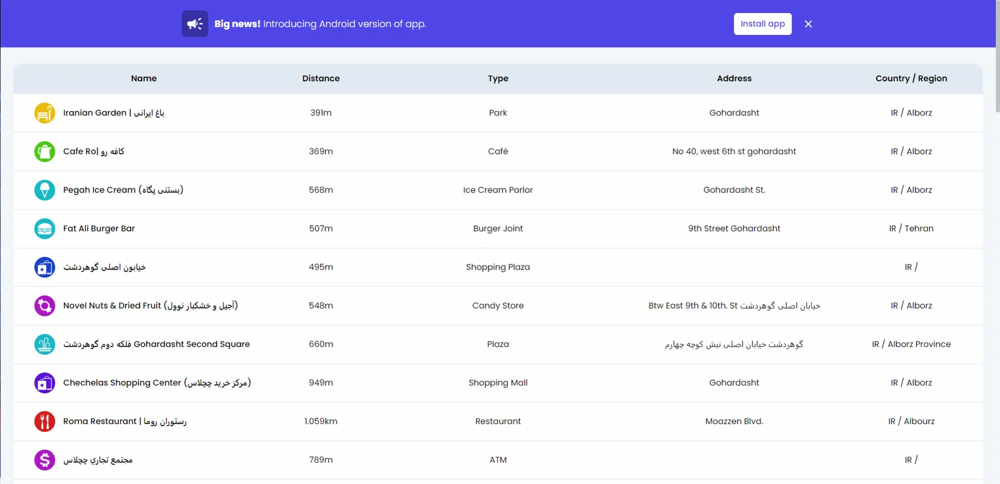
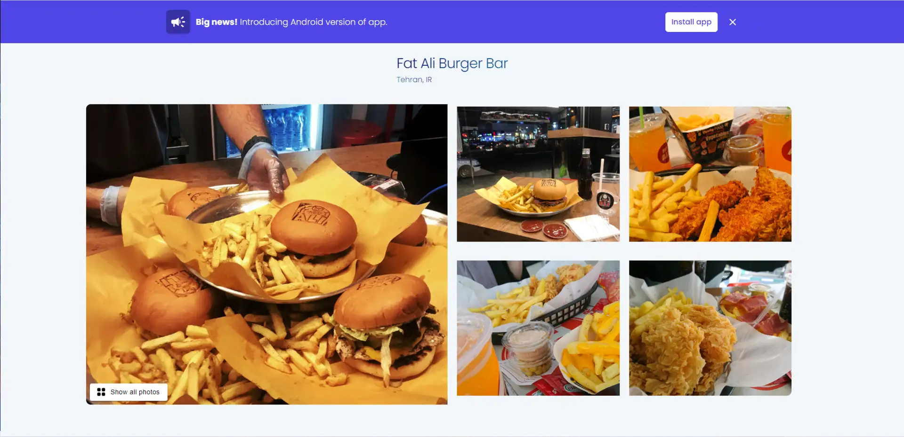
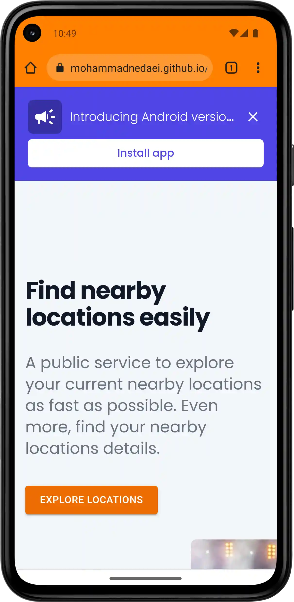
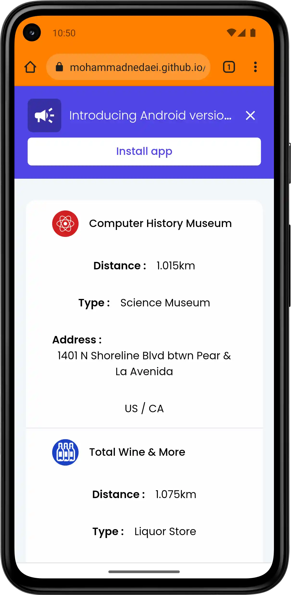
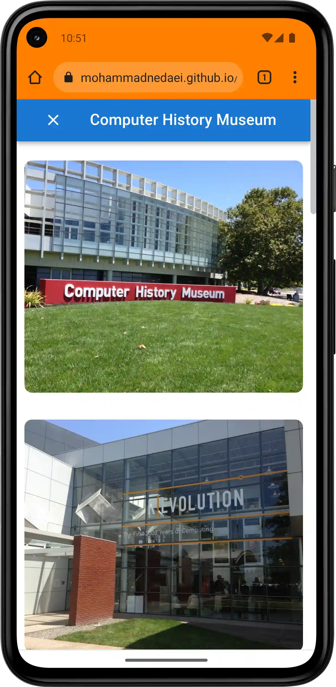

# 🗺️ &middot; [Nearby Locations React](https://mohammadnedaei.github.io/Nearby-Locations-React/) &middot;

[](https://github.com/mohammadnedaei/Nearby-Locations-React/blob/main/LICENSE)
[](https://github.com/mohammadnedaei/Nearby-Locations-React/fork)
[](https://codebeat.co/projects/github-com-mohammadnedaei-nearby-locations-react-main)
[](https://www.codefactor.io/repository/github/mohammadnedaei/nearby-locations-react)
[](https://www.codacy.com/gh/mohammadnedaei/Nearby-Locations-React/dashboard?utm_source=github.com&amp;utm_medium=referral&amp;utm_content=mohammadnedaei/Nearby-Locations-React&amp;utm_campaign=Badge_Grade)
[](#)
[](https://gtmetrix.com/reports/mohammadnedaei.github.io/O2ybS3Z2/)

## 🔎 Overview

`Nearby Locations` is a public service to explore your current nearby places as fast as possible. Even more, find
your nearby locations details. Created with `React` with awesome `components`.

### This app looks like this:

#### Screenshots may change in the future because of UI/UX changes.

### 🖥️ Desktop view:

<a href="https://raw.githubusercontent.com/mohammadnedaei/Nearby-Locations-React/dev/public/screenshots/lg-homepage.webp"></a>

<a href="https://raw.githubusercontent.com/mohammadnedaei/Nearby-Locations-React/dev/public/screenshots/lg-locations.webp"></a>

<a href="https://raw.githubusercontent.com/mohammadnedaei/Nearby-Locations-React/dev/public/screenshots/lg-details.webp"></a>

### 📱 Mobile view:

| Homepage                                                                                                                                                                                                                                    | Locations                                                                                                                                                                                                                                    | Details                                                                                                                                                                                     |
|---------------------------------------------------------------------------------------------------------------------------------------------------------------------------------------------------------------------------------------------|----------------------------------------------------------------------------------------------------------------------------------------------------------------------------------------------------------------------------------------------|---------------------------------------------------------------------------------------------------------------------------------------------------------------------------------------------|
| <a href="https://raw.githubusercontent.com/mohammadnedaei/Nearby-Locations-React/dev/public/screenshots/sm-homepage.webp"></a> | <a href="https://raw.githubusercontent.com/mohammadnedaei/Nearby-Locations-React/dev/public/screenshots/sm-locations.webp"></a> | <a href="https://raw.githubusercontent.com/mohammadnedaei/Nearby-Locations-React/dev/public/screenshots/sm-details.webp"></a>

## 🚀 Usage

Run this commands in **respectively** in your terminal.

```shell
 git clone https://github.com/mohammadnedaei/Nearby-Locations-React.git
```

```shell
 cd Nearby-Locations-React
```

```shell
 npm i
```

Change `.env` properties depending in your information and then go to the next step.

```shell
 npm start
```

`npm start` Runs the app in the development mode.
Open http://localhost:3000 to view it in your browser.
The page will reload when you make changes.
You may also see any lint errors in the console.

### 🧰 Libraries and Tools

✅ Responsive Design & Mobile Friendly \
✅ PWA (5/7) \
✅ Lighthouse

- Performance (%99)
- Lighthouse Accessibility (%100)
- Lighthouse Best Practices (%92)
- Lighthouse SEO (%100)

✅ Heroicons \
✅ Tailwind UI \
✅ Material UI

- Material icons

✅ Axios \
✅ React Router \
✅ React Hooks \
✅ jQuery \
✅ React Responsive Carousel \
✅ React Gradient Text (rgt) \
✅ Github Pages \
✅ Foursquare API

### 🔧 Contributing

Feel free to fork this repo and make pull requests.
You can learn more about `React` [here](https://reactjs.org/)

### 🎯 TODO

🚧 Code factor & code quality tools improvements \
🔃 Add Shortcuts in manifest \
🚧 Include rating API (use in locations page and details) \
🚧 Fix desktop Chrome and Opera geolocation bug \
🚧 Add a Loader for locations list \
🔃 StoryBook \
🔃 Add install button in settings for PWA desktop \
🔃 Service Worker for push notifications \
🔃 Service Worker for Cache \
🔃 Service Worker for fetch

### 💚 Support

<a href="https://sociabuzz.com/mohammadnedaei/donate" target="_blank"></a>

### ✍🏻 Author

     Mohammad Nedaei

### 📞 Contact

    Discord: Mohammad81#3277

[Linkedin](https://www.linkedin.com/in/mohammad-nedaei-47789b1a6/)

### ©️ License

`Nearby Locations` is [MIT licensed](./LICENSE).